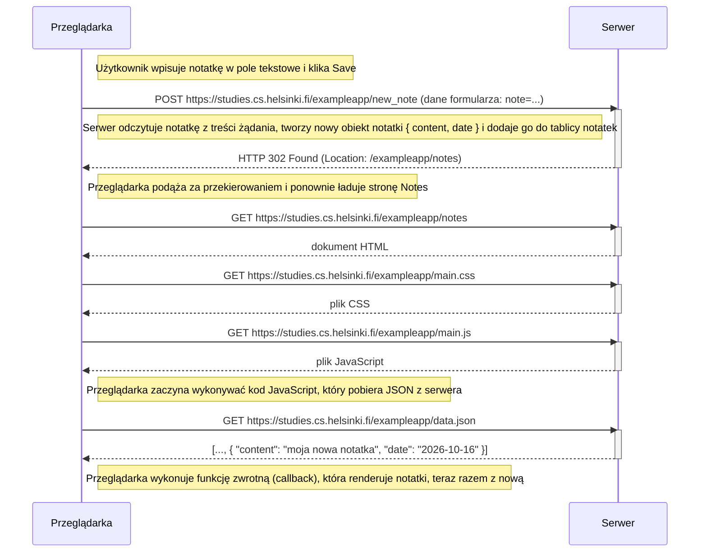

# 0.4: Diagram nowej notatki

```mermaid
sequenceDiagram
    participant browser as Przeglądarka
    participant server as Serwer

    Note right of browser: Użytkownik wpisuje notatkę w pole tekstowe i klika Save

    browser->>server: POST https://studies.cs.helsinki.fi/exampleapp/new_note (dane formularza: note=...)
    activate server
    Note left of server: Serwer odczytuje notatkę z treści żądania, tworzy nowy obiekt notatki { content, date } i dodaje go do tablicy notatek
    server-->>browser: HTTP 302 Found (Location: /exampleapp/notes)
    deactivate server

    Note right of browser: Przeglądarka podąża za przekierowaniem i ponownie ładuje stronę Notes

    browser->>server: GET https://studies.cs.helsinki.fi/exampleapp/notes
    activate server
    server-->>browser: dokument HTML
    deactivate server

    browser->>server: GET https://studies.cs.helsinki.fi/exampleapp/main.css
    activate server
    server-->>browser: plik CSS
    deactivate server

    browser->>server: GET https://studies.cs.helsinki.fi/exampleapp/main.js
    activate server
    server-->>browser: plik JavaScript
    deactivate server

    Note right of browser: Przeglądarka zaczyna wykonywać kod JavaScript, który pobiera JSON z serwera

    browser->>server: GET https://studies.cs.helsinki.fi/exampleapp/data.json
    activate server
    server-->>browser: [..., { "content": "moja nowa notatka", "date": "2026-10-16" }]
    deactivate server

    Note right of browser: Przeglądarka wykonuje funkcję zwrotną (callback), która renderuje notatki, teraz razem z nową
```
