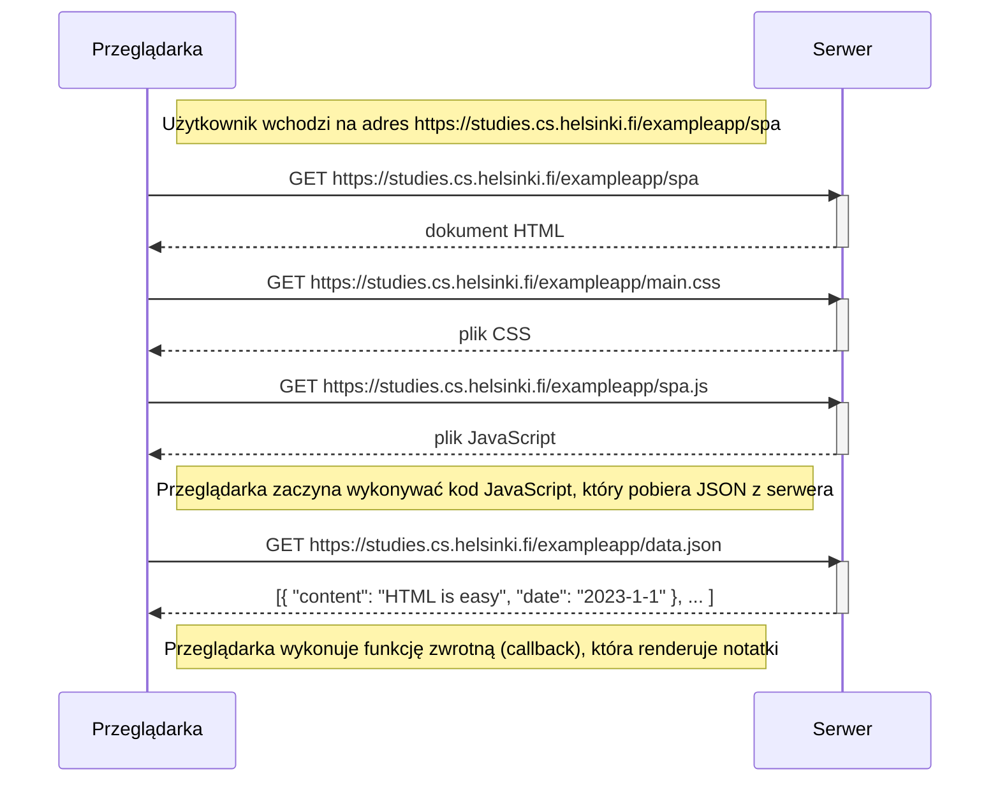

# 0.5: Diagram aplikacji single page app (SPA)

```mermaid
sequenceDiagram
    participant browser as Przeglądarka
    participant server as Serwer

    Note right of browser: Użytkownik wchodzi na adres https://studies.cs.helsinki.fi/exampleapp/spa

    browser->>server: GET https://studies.cs.helsinki.fi/exampleapp/spa
    activate server
    server-->>browser: dokument HTML
    deactivate server

    browser->>server: GET https://studies.cs.helsinki.fi/exampleapp/main.css
    activate server
    server-->>browser: plik CSS
    deactivate server

    browser->>server: GET https://studies.cs.helsinki.fi/exampleapp/spa.js
    activate server
    server-->>browser: plik JavaScript
    deactivate server

    Note right of browser: Przeglądarka zaczyna wykonywać kod JavaScript, który pobiera JSON z serwera

    browser->>server: GET https://studies.cs.helsinki.fi/exampleapp/data.json
    activate server
    server-->>browser: [{ "content": "HTML is easy", "date": "2023-1-1" }, ... ]
    deactivate server

    Note right of browser: Przeglądarka wykonuje funkcję zwrotną (callback), która renderuje notatki
```
