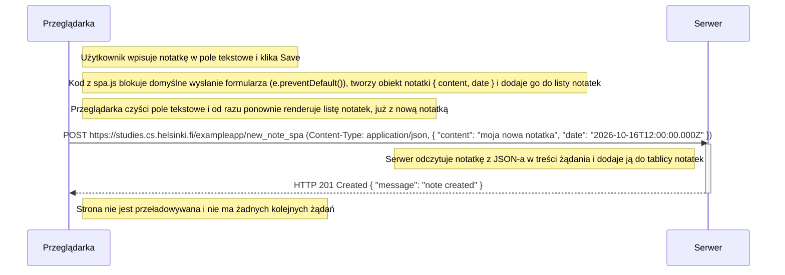

# 0.6: Diagram nowej notatki w wersji SPA

```mermaid
sequenceDiagram
    participant browser as Przeglądarka
    participant server as Serwer

    Note right of browser: Użytkownik wpisuje notatkę w pole tekstowe i klika Save

    Note right of browser: Kod z spa.js blokuje domyślne wysłanie formularza (e.preventDefault()), tworzy obiekt notatki { content, date } i dodaje go do listy notatek

    Note right of browser: Przeglądarka czyści pole tekstowe i od razu ponownie renderuje listę notatek, już z nową notatką

    browser->>server: POST https://studies.cs.helsinki.fi/exampleapp/new_note_spa (Content-Type: application/json, { "content": "moja nowa notatka", "date": "2026-10-16T12:00:00.000Z" })
    activate server
    Note left of server: Serwer odczytuje notatkę z JSON-a w treści żądania i dodaje ją do tablicy notatek
    server-->>browser: HTTP 201 Created { "message": "note created" }
    deactivate server

    Note right of browser: Strona nie jest przeładowywana i nie ma żadnych kolejnych żądań
```
